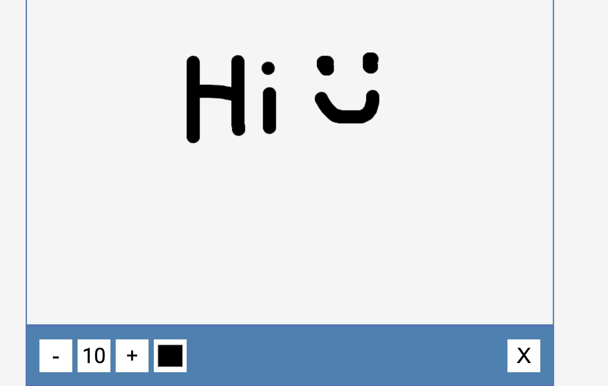

### Drawing App
## Overview
This simple drawing app is created using HTML, CSS, and JavaScript. It allows users to unleash their creativity by drawing on the canvas. The app is lightweight, easy to use, and can be integrated into any web project.

## [Live Demo](https://shreejithns.github.io/drawing-app/)

## Features

1.Canvas Drawing: Users can draw freely on the canvas using the mouse or touch input.

2.Color Palette: Choose from a variety of colors to make your drawings vibrant.

3.Brush Size: Customize the brush size to control the thickness of your strokes.
   
4.Clear Canvas: Clear the canvas with a single click to start fresh.

5.Responsive Design: The app is designed to work seamlessly on various devices and screen sizes.
   
## Getting Started
To use the drawing app, follow these simple steps:

## Clone the Repository:

bash
Copy code
git clone https://github.com/shreejithns/drawing-app.git
# Open the Project:
Navigate to the project directory and open the index.html file in your preferred web browser.

## Start Drawing:
Use the mouse or touch input to start creating your masterpiece.

## Folder Structure
1. css: Contains the stylesheets for the app.

2.  styles.css: Defines the styles for the app interface.
3. js: Includes the JavaScript files for the app.

4. app.js: Implements the drawing functionality and user interactions.
index.html: The main HTML file that includes the structure of the app.

## ScreeenShot 

